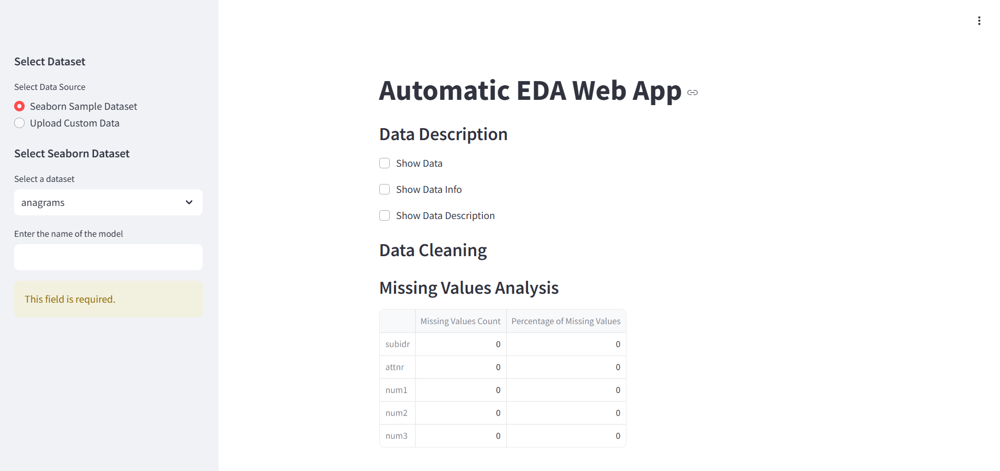

# 📊 Automatic EDA Web App

<!--  -->

## 🔥 Overview
AutoEDA is an open-source Python application designed to streamline the process of Exploratory Data Analysis (EDA) for data scientists, analysts, and anyone working with data. EDA is a crucial step in understanding your dataset, finding patterns, and preparing data for further analysis. AutoEDA simplifies this process by providing an interactive web-based platform to explore, visualize, and preprocess your data effortlessly.

## 🚀 Features
- 📂 Upload CSV files for analysis
- 📊 Display dataset preview & summary statistics
- 📈 Generate interactive visualizations
- 🔍 Detect and visualize missing values
- 📉 Show correlation heatmaps
- 🧹 Data cleaning and transformation recommendations
- 📌 Supports various data types

**[Live Website Link](https://automatic-eda-web-app.onrender.com)**

## Preview


This is the home screen of the web application. From here, you can upload any dataset you want and perform Exploratory Data Analysis right through the web.


## Why AutoEDA?

- Efficiency: AutoEDA automates routine EDA tasks, saving you time and effort.

- Interactivity: Visualize your data interactively to gain insights quickly.

- User-Friendly: No coding required. All tasks can be performed using the user-friendly web interface.

## Current Progress

**Dataset Overview:** Users can load and preview their datasets, access basic dataset statistics, and check for missing data.

**Data Exploration and Visualization:** Users can explore numerical and categorical features, create histograms, scatter plots, and other visualizations.

**Data Preprocessing**: Users can now perform data preprocessing tasks, including handling missing data, encoding categorical variables,feature scaling, identifying and handling outliers and more, directly from the web interface. This streamlines the data preparation process and saves time.
## Roadmap

I am actively working on enhancing and expanding the data preprocessing feature, as well as adding more features to the application. My goal is to continually improve the user experience and provide a comprehensive set of tools for data analysis and preprocessing. I'm dedicated to making the project even more powerful and user-friendly, so stay tuned for exciting updates and improvements! Your feedback and suggestions are highly appreciated as they help shape the future of this project.


## Try AutoEDA

I invite you to try AutoEDA for yourself. Upload your dataset, explore its features, and visualize the data. I appreciate your feedback and suggestions to make AutoEDA even better.

- Make sure you have Python 3 installed.

- Clone this repository to your local machine.

```sh
git clone https://github.com/tushar8057/auto-eda-webapp.git
cd auto-eda-webapp
```

- Open your command line or terminal.

- Navigate to the project directory.

```sh
cd auto-eda-webapp
```

- Run the following command to install the required Python libraries:

```sh 
pip install -r requirements.txt
```

- To start the application, just run the following line in terminal

```sh
streamlit run main.py
```

This will run the web application on your default web browser

## Contibutions
AutoEDA is an open-source project, and I welcome contributions from the community. You can help by reporting issues, contributing code, or suggesting new features.
